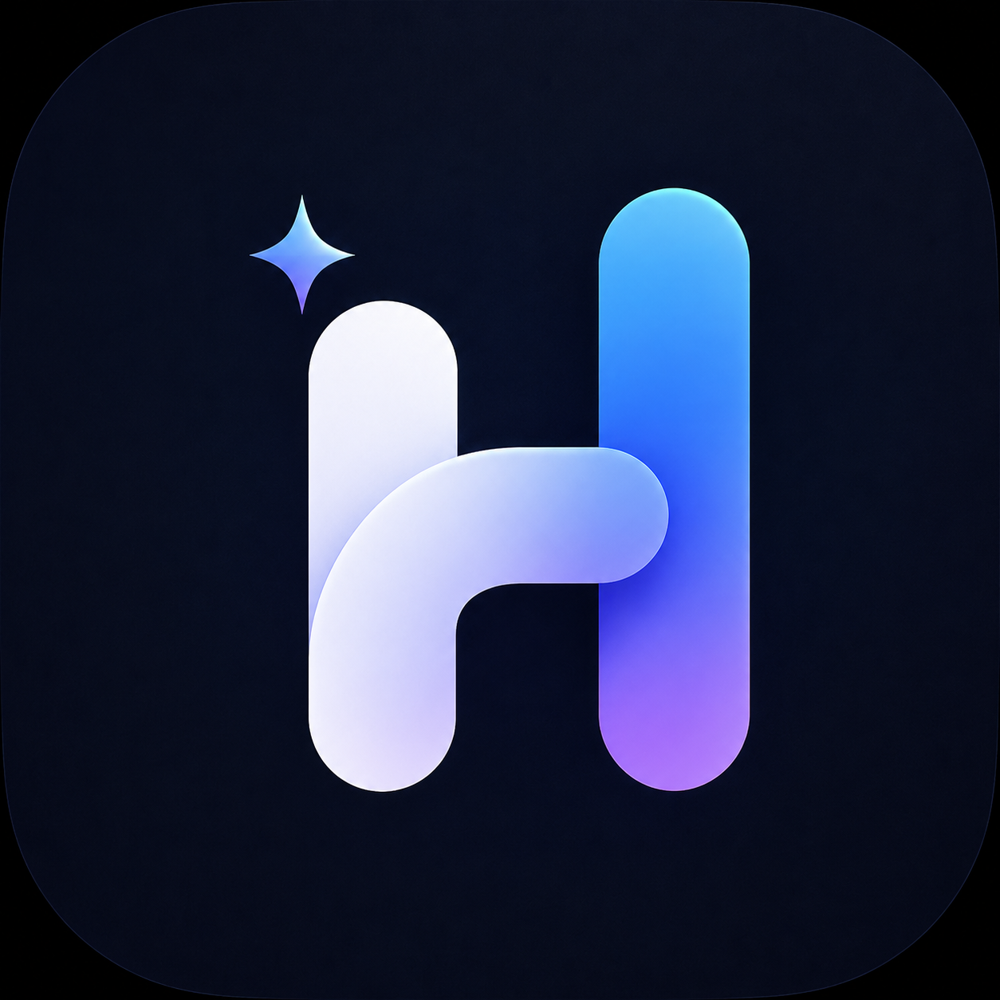
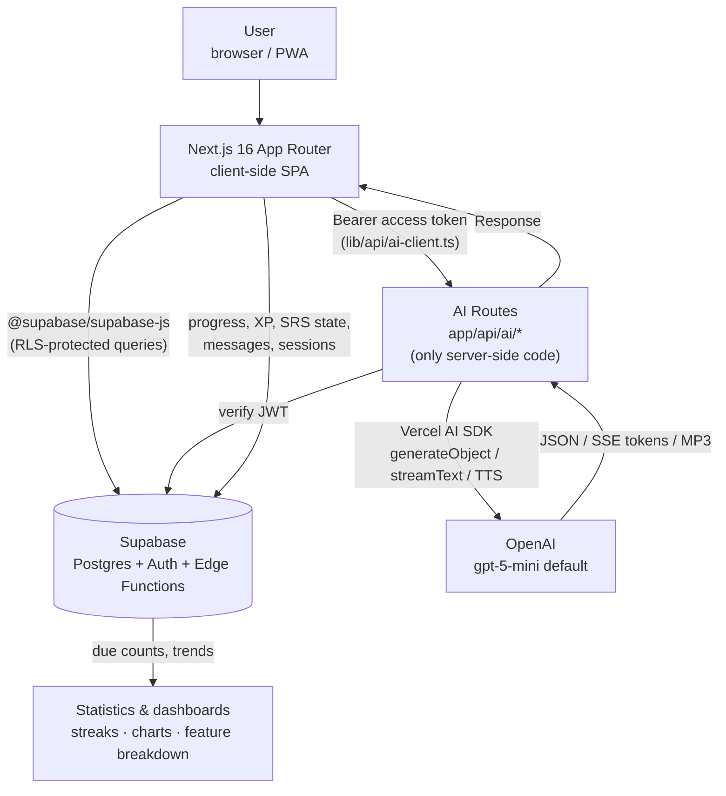
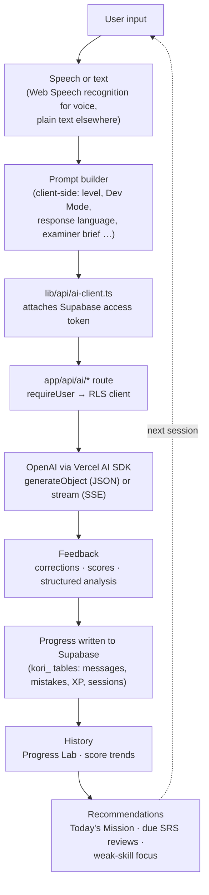
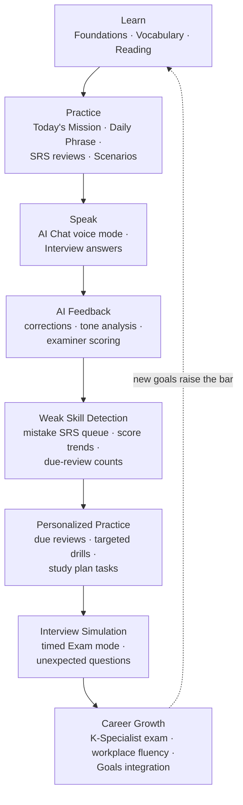
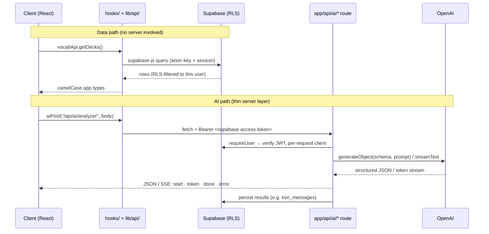

<div align="center">



# Hengo

**An AI-powered Korean learning platform for software engineers and international professionals working in Korea.**

[](package.json)
[](#18-license)
[](https://nextjs.org)
[](https://react.dev)
[](https://www.typescriptlang.org)
[](https://supabase.com)
[](https://platform.openai.com)
[](https://tailwindcss.com)

[Why Hengo](#2-why-hengo-exists) · [Features](#4-key-features) · [Architecture](#6-product-architecture) · [K-Specialist Interview](#9-k-specialist-interview-module) · [Development Guide](#13-development-guide) · [Roadmap](#16-roadmap)

</div>

---

## Table of Contents

1. [Hero](#hengo)
2. [Why Hengo Exists](#2-why-hengo-exists)
3. [Product Vision](#3-product-vision)
4. [Key Features](#4-key-features)
5. [Screenshots](#5-screenshots)
6. [Product Architecture](#6-product-architecture)
7. [AI Workflow](#7-ai-workflow)
8. [Learning Journey](#8-learning-journey)
9. [K-Specialist Interview Module](#9-k-specialist-interview-module)
10. [Technology Stack](#10-technology-stack)
11. [Project Structure](#11-project-structure)
12. [Application Architecture](#12-application-architecture)
13. [Development Guide](#13-development-guide)
14. [Design System](#14-design-system)
15. [Performance](#15-performance)
16. [Roadmap](#16-roadmap)
17. [Contributing](#17-contributing)
18. [License](#18-license)
19. [Author](#19-author)

---

## 2. Why Hengo Exists

### The problem

Generic Korean learning apps teach you to order coffee. They do not teach you to:

- explain a production incident to a Korean teammate,
- decode the politeness level of a manager's Kakao message,
- survive a spoken K-Specialist visa interview,
- or write a status update in workplace-appropriate Korean.

Foreign software engineers in Korea live in a very specific language gap: fluent enough in English to do the job, but blocked daily by **workplace and technical Korean** — the register no textbook covers.

### Who it is built for

- Software engineers working (or planning to work) in Korea
- Foreign professionals navigating Korean workplace communication
- K-Specialist visa candidates preparing for the spoken exam
- Learners who want AI-assisted, feedback-driven study instead of static lessons

### The philosophy: learning by doing

Hengo is built around one belief: **you learn a language by using it under realistic pressure, with immediate feedback** — not by completing lesson N+1.

Every feature closes the same loop:

1. **Do something real** — hold a conversation, answer an interview question, decode an actual message you received.
2. **Get AI feedback** — corrections, tone analysis, better alternatives.
3. **Turn mistakes into study material** — errors flow into a spaced-repetition review queue automatically.
4. **Repeat with harder material** — the app surfaces what is due and what is weak.

Existing apps stop at step 1. Hengo is the loop.

---

## 3. Product Vision

Hengo is not only a Korean app. It is an **AI learning and growth platform** whose first vertical is Korean for professionals — the same engine (AI conversation, structured feedback, spaced repetition, goal tracking, progress analytics) generalizes to any skill you practice through language.

Today it already combines what would normally be seven separate apps:

| Pillar | What Hengo does |
|---|---|
| Language tutor | AI conversation, vocabulary SRS, reading, listening, foundations |
| Interview coach | Full K-Specialist mock interview simulator with scoring |
| Workplace assistant | Message analyzer and generator for real Korean workplace communication |
| Productivity system | Outcome-based goals with key results, plan phases, schedules, tasks, calendar, and an AI goal coach |
| Progress tracker | Dashboard, streaks, XP/achievements, history, timeline, daily/weekly review, weak-skill detection |
| Personal growth platform | Habits (Growth workspace) — identity-based habit streaks, journaling, and domain-neutral behavior-change support (Recovery) |
| Second brain | Quick-capture inbox, knowledge library, journal, universal reminders, and **Ask Hengo** — a question-answering layer over your own data |

The long-term direction extends the same platform into:

- **AI mentor** — a persistent coach that knows your history, level, and goals
- **AI interview coach** — beyond K-Specialist: job interviews, performance reviews
- **Career coach** — long-term growth planning tied to the goals system
- **Personalized learning** — study plans generated from measured weaknesses, not fixed curricula
- **Workplace assistant** — deeper integration with the messages, documents, and meetings of a real Korean job

---

## 4. Key Features

Features are grouped into seven product areas. All routes live under `app/(main)/` unless noted.

### AI Learning

The unified **AI Coach** workspace at `/chat` has four tabs, all backed by the `app/api/ai/*` routes:

| Feature | Purpose | Benefits | Main technologies |
|---|---|---|---|
| **AI Chat** | Free Korean conversation with an AI partner | "Dev Mode" for technical Korean, Korean voice mode, response-language control; conversation is the core practice surface | SSE streaming (`chat/stream`), Vercel AI SDK, messages persisted to `kori_messages` |
| **Realtime voice panel** | Low-latency spoken conversation inside Chat | Live turn-taking with in-flight correction policy, session metrics, and an end-of-session report | `components/chat/RealtimeVoicePanel.tsx`, `hooks/useRealtimeVoice.ts`, `lib/realtime/*`, `realtime/{session,analyze-turn}` routes |
| **Message Analyzer** | Decode a real Korean message you received | Explains tone, politeness level, hidden nuance, and suggests replies — workplace survival tool | `analyzer` route, `generateObject` + Zod schema |
| **Message Generator** | Turn an English intent into Korean | Produces the same message across formality levels so you pick the right register | `message-generator` route, structured JSON output |
| **AI Goal Coach** | Streamed coaching on your goals | Suggests concrete tasks and plans inside the Goals feature | `goals/coach` (SSE) and `goals/generate-tasks` |
| **Corrections (SRS)** | Review your past mistakes | Every correction becomes a flashcard graded Again/Hard/Good/Easy — mistakes are the syllabus | `corrections/check` route, custom SRS engine in `lib/srs.ts` |

**Ask Hengo** (`/ask-hengo`) is the second surface in the AI workspace — a question-answering layer over your *own* data rather than a Korean tutor. See [Second Brain](#second-brain) below.

### Korean Learning

| Feature | Route | Purpose | Benefits | Main technologies |
|---|---|---|---|---|
| **Foundations** | `/learn`, `/learn/[lessonId]` | Absolute-beginner Korean: Survival / Alphabet / Grammar tracks | Structured on-ramp before the AI-driven features | Per-lesson runner, Supabase-backed progress |
| **Vocabulary** | `/vocab` | Spaced-repetition decks with AI generation, import, and challenges | AI builds decks for your level; dictionary lookup; sentence challenges force production, not just recognition | SRS (`lib/srs.ts`, `lib/vocab-review.ts`), `vocab/{generate,lookup,check-sentence,sentence-challenge}` routes, `es-hangul` |
| **Phrasebook** | `/phrasebook`, `/phrasebook/[collectionId]`, `/phrasebook/practice`, `/phrasebook/new` | Structured workplace & daily-life Q&A: Learn, Listen, Speak, and SRS Review modes | Curated Workplace Essentials + Daily Life Essentials packs, plus your own Q&A cards; listen → answer aloud → get AI feedback → review with spaced repetition | `lib/korean-phrasebook/*` (seed, mastery, import — pure + unit tested), `lib/api/phrasebook.ts`, `api/ai/phrasebook/evaluate`, `lib/srs.ts`; see `docs/korean-phrasebook-implementation.md` |
| **Reading** | `/reading` | Multi-unit reading practice | Tap-to-translate, audio playback, comprehension quizzes | `lib/reading.ts`, TTS route |
| **Listening** | `/listening` | AI-generated listening passages | Slow/normal playback, transcript, quiz — part of the Learning workspace nav | `listening/generate` route, TTS |
| **Daily Practice / Today** | `/practice` | The home surface: "Today's Mission" checklist | One place showing vocab due, daily phrase, mistakes due, and scenario practice, mixed for your level | `daily-phrase/{generate,practice,check-practice}` routes |
| **Daily Study Plan** | `/practice/today`, `/learn/today` | A day-sized Korean plan you can actually finish | Three time budgets (**busy / normal / office**) build a plan out of review, shadowing, vocabulary, roleplay, and correction-retry activities; expressions carry romanization, usage notes, and example dialogue, with voice practice per line | `lib/daily-study-plan.ts` (+ Zod schemas), `hooks/useDailyStudyPlan.ts`, `components/daily-study/*`, `daily-study-plan/correct` route; mistakes sync back into the correction review queue |
| **AI Korean Voice Coach** | `/korean-coach` | Transcript-hidden listening and scenario speaking practice | Secure chained transcription → structured correction → AI voice retry; deduplicated mistake notebook, preferences, and session summaries | MediaRecorder, `app/api/ai/korean/*`, Supabase RLS; [architecture and setup](docs/ai-korean-voice-coach.md) |

> `/daily-phrase` redirects to `/practice` and `/mistakes` redirects to the Corrections tab in AI Coach — both were merged into larger surfaces, and the redirect stubs are kept deliberately so old bookmarks still work.

### Speaking

| Feature | Route | Purpose | Benefits | Main technologies |
|---|---|---|---|---|
| **Exam Prep (Interview)** | `/interview` | Full K-Specialist mock interview simulator | See the [dedicated section below](#9-k-specialist-interview-module) | `chat/stream` with examiner prompts, Web Speech recognition, TTS |
| **Speaking drill** | `/interview/speaking` | Daily question-bank drill with per-answer grading | A practice dashboard picks today's queue by weakness and recommended difficulty; answer by voice, get a scored correction, then retry the fixed version | `lib/interview-practice.ts`, `lib/interview-drills.ts`, `interview/{speaking-check,evaluate,drill-questions}` routes, `kori_interview_question*` tables |
| **Listening drill** | `/interview/listening` | Hear the question before you see it | Trains comprehension under exam conditions — the text stays hidden until you commit | `ListeningQuestionCard`, TTS route, same drill queue logic |
| **Repeat drill** | `/interview/repeat` | Shadow model answers sentence by sentence | Listen → repeat → compare, for fluency and pronunciation rehearsal | `lib/repeat-drill.ts`, TTS + speech recognition |
| **Script Writer** | `/interview/script` | Write and rehearse the 7-section exam script | Autosaves locally, syncs to your account, separate Q&A prep tab; weak questions flow into the speaking drill's focus mode | `lib/api/interview.ts`, Supabase persistence |
| **Scenarios** | `/scenarios` | Roleplay prompts for real-life and workplace situations | Launches a guided AI conversation in Chat with the scenario as context | Chat streaming with scenario prompts |

### Productivity

| Feature | Route | Purpose | Benefits | Main technologies |
|---|---|---|---|---|
| **Goals** | `/goals`, `/goals/[id]/{plan,tasks,schedule,progress}` | Outcome-based goal system, not just a task list | A goal detail page has five sections: **Overview · Plan · Tasks · Schedule · Progress**. Goals carry **key results** with measurable targets, **evidence** entries proving progress, **plan phases** that break a goal into stages, and **schedule rules** that generate recurring work. A health status (`attention` / `at_risk` / `blocked`) surfaces goals that have gone quiet, and periodic **goal reviews** record what changed | `lib/api/goal-{key-results,evidence,plan-phases,schedule-rules,reviews}.ts`, `lib/goal-health.ts`, `lib/goal-progress.ts`, `lib/weekly-capacity.ts`; migrations `goal_outcomes_v2`, `goal_plan_phases_schedule_rules`, `task_workflow_status` |
| **Goal creation & sharing** | `/goals/create` (+ `custom`, `template/[templateId]`), `/goals/join/[code]` | Start from a template or from scratch; collaborate on a goal | ~7 template families (career, education, financial, fitness, health, creative, personal) in `lib/goal-templates/`; a share code lets someone else join a goal (Orbit's `join_goal` RPC + `goal_members`) | `lib/goal-form.ts`, Zod validation |
| **Learning-metric goals** | inside `/goals` | Goals that track real learning activity automatically | Tasks that name a learning feature get a "Practice →" deep link (`lib/learning-task-link.ts`), and a goal can **auto-track a live metric** (vocab saved, corrections logged, foundation lessons, feature sessions — daily/weekly/all-time) via `metadata.learning_metric` (`components/goals/LearningMetricCard.tsx`) instead of a manual checklist — productivity and learning are one system | `progressApi.getMetricCount`, AI Goal Coach streaming |
| **Inbox (Quick Capture)** | `/inbox` | Get a thought out of your head in a few seconds | Capture by keyboard (⌘K → *Quick capture*), header button, or mobile FAB — with optional voice dictation — then process each item explicitly into a Note, Task, or Journal entry. Conversion never deletes the original; it stamps `status = processed` and records what it became | `lib/inbox.ts` (pure + tested), `lib/api/inbox.ts`, `lib/quick-capture-bus.ts`, `kori_inbox_items` (Postgres FTS) |
| **Dashboard** | `/dashboard` | Productivity command center | Goals overview, today's tasks, upcoming deadlines, and a roadmap teaser — one place to see what needs you today | TanStack Query |
| **Notes (Knowledge Library)** | `/notes`, `/notes/new`, `/notes/[slug]` | Personal knowledge library (Java/Spring/SQL/Korean/decisions/ideas) | Typed notes, pinning, tags, source URLs, and **server-side full-text search** over the note body — plus Write/Preview markdown editing with autosave draft protection | `lib/notes.ts`, `lib/notes-markdown.ts`, `marked`, `kori_notes` `tsvector` + GIN |
| **Reminders** | `/settings/reminders` | One reminder system for anything in the app | Attach a one-off or recurring reminder (daily / weekly / weekdays, timezone-aware and DST-safe) to a habit, note, inbox item, or journal prompt; delivery reuses the existing web-push + Telegram fan-out | `lib/reminders.ts` (`computeNextRunAt`, mirrored in SQL as `kori_next_reminder_run`), `kori_reminders`, `pg_cron` dispatch |
| **Roadmap** | `/roadmap` | Learning roadmap with study sections/milestones | Customizable sections persisted locally | Local persistence |

### Progress

| Feature | Route | Purpose | Benefits | Main technologies |
|---|---|---|---|---|
| **History (Progress Lab)** | `/history` | Past study sessions and attempts across features | See what you actually did, not what you planned | Supabase, `lib/api/progress.ts` |
| **Achievements** | `/achievements` | XP, levels, skill badges | A compact level/XP badge (`components/achievements/LevelBadge.tsx`) sits in the desktop and mobile top bars on every page | Supabase-backed XP model |
| **Statistics** | `/statistics` | One analytics view for the whole platform | Streak, weekly minutes, XP, weekly progress chart, and a per-feature time breakdown across Learning and Productivity | Recharts, `lib/api/progress.ts` |
| **Timeline** | `/timeline` | Everything that happened, in one stream | A client-side merge of six sources — manual activities, journal entries, completed tasks, habit check-ins, time spent inside Hengo, and Recovery check-ins — grouped by day, with day/week/month, type, and search filters. Time-in-app rows are collapsed into one "N min in X" entry per day+feature so they don't drown the real events | `lib/timeline.ts` (pure `buildTimeline`, tested), `lib/date-utils.ts`, `hooks/useTimeline.ts` |
| **Review** | `/review/morning`, `/review/evening`, `/review/weekly` | Daily and weekly review rituals | **Morning Brief** (today's tasks, habits not yet checked in, due reminders, goals needing attention), **Evening Review** (what actually happened today), **Weekly Review** (7-day totals + per-habit completion). Each gets an AI summary and one focus suggestion, generated from counts only — never raw personal content | `lib/review.ts` (pure builders, tested), `review/summarize` route, `components/review/*` |

### Growth

A separate workspace for personal behavior-change, distinct from the language-learning pillars above. Three features are shipped; three are placeholders (`soon` flag in `lib/navigation.ts`, disabled nav entries).

| Feature | Route | Purpose | Benefits | Main technologies |
|---|---|---|---|---|
| **Habits** | `/growth/habits`, `/growth/habits/[id]` | Generic daily habit tracking (exercise, reading, meditation, sleep, water, study, coding, deep work, walking, or a custom category) | Simple daily check-off with current streak, longest streak, and consistency % | `lib/habits.ts` (pure, calendar-date streak math), `lib/api/habits.ts` |
| **Recovery** | `/growth/recovery` (+ `log`, `urge`, `pause`, `debrief`, `plan`, `plans`, `triggers`, `check-in`, `checkins`, `review`, `insights`, `settings`, `[id]`) | Support for urges and compulsive patterns: logging a moment, a guided breathing pause, a calm post-slip debrief, spaced-repetition if-then plans, daily check-ins, and an insights view | **Domain-neutral by design** — no specific behavior is ever named in code, copy, or commit history; habit labels are user-entered free text only. Live elapsed-time clock; full CRUD on habits, triggers, check-ins, and plans | `lib/recovery.ts` (SRS-adapted plan scheduling via `lib/srs.ts`, KST-aware day boundaries), `lib/recovery-lock.ts`, `lib/recovery-notifications.ts`, `lib/recovery-schemas.ts`, `lib/api/recovery.ts`, `recovery-coach` route |
| **Journal** | `/growth/journal` | Daily journaling with a four-prompt template | Achievement / blocker / lesson / gratitude prompts plus mood and energy (1–5), optional goal or habit link, tags — nothing is mandatory, but an entirely blank entry is rejected. Entries feed the Timeline and Evening Review | `lib/journal.ts` (pure + tested), `lib/api/journal.ts`, `kori_journal_entries` (FTS) |
| Deep Work · Mood · Rewards | `/growth/focus`, `/growth/mood`, `/growth/rewards` | Planned: focus sessions, mood tracking, milestone rewards | — | — |

> Recovery's underlying Supabase tables are still named `kori_focus_*` — they pre-date the Growth-workspace rename and hold live user data, so a table rename wasn't worth the migration risk. App-facing code and types use `Recovery*` naming throughout (`lib/api/recovery.ts` maps between them).

### Second Brain

Cutting across the workspaces above is a personal-knowledge layer: capture anything fast, process it deliberately, and ask questions about your own history later.

**Capture → Process → Recall.** [Inbox](#productivity) takes the raw thought; [Notes](#productivity), [Journal](#growth), and Tasks are what it becomes; [Timeline](#progress) and [Review](#progress) show it back to you; [Reminders](#productivity) bring things back at the right time. The sixth piece — **Ask Hengo** — answers questions about all of it:

| Feature | Route | Purpose | Benefits | Main technologies |
|---|---|---|---|---|
| **Ask Hengo** | `/ask-hengo`, `/ask-hengo/memories` | Ask questions about your own notes, goals, habits, journal, and Korean mistakes | Retrieval runs **9 parallel bounded queries** — Postgres full-text search over notes/inbox/journal plus structured reads of approved memories, active goals, repeated corrections, completed tasks, and recent activities. Answers are labeled `grounded` / `partial` / `insufficient` and carry **citations resolved server-side**, so the model can reference an item it was actually shown but never fabricate a source | `lib/server/memory-retrieval.ts`, `memory/ask` route, `lib/memory.ts`, `kori_memory_candidates` |
| **Memory review queue** | `/ask-hengo/memories` | You approve what Hengo remembers | Facts the model notices land as `proposed` candidates and are **never auto-approved** — only approved rows are read back into a later prompt. Approve (with editing), reject, archive, or add a memory yourself | `memoryApi`, `hooks/useMemory.ts` |

Two safety properties are deliberate and worth calling out: retrieved content is wrapped in a `<user_data>` block with a system prompt that treats it as **data, never instructions** (prompt-injection mitigation), and retrieval uses the per-request RLS client like every other query — no service key, no cross-user reach.

> Retrieval is Postgres FTS (`tsvector` + GIN), not embeddings. Vector search was deliberately deferred rather than half-built — see `docs/second-brain-implementation.md` for the full six-phase record, including the known gaps.

### App surfaces

| Surface | Route | Notes |
|---|---|---|
| Landing page | `/` | Marketing/intro page — feature highlights, links to Login/Register. GSAP + Lenis scroll animations |
| Home / Today | `/home` | Immersive "pick a lane" screen — four poster cards (**Korean Learning**, **Goal Setting**, **Your Progress**, **Habits & Recovery**) with live stats; rendered with no sidebar, top bar, or tabs. The first three deep-link to the last route you visited in that workspace (`lib/last-visited.ts`); the Growth card links to a fixed `/growth/habits` |
| Login / Register | `/login`, `/register` | Supabase auth — email/password + Google sign-in (route group `(auth)`) |
| Password reset | `/forgot-password`, `/reset-password` | Supabase email recovery flow |
| Onboarding | — | A first-run wizard (`components/onboarding/OnboardingFlow.tsx`) shown once inside `app/(main)/layout.tsx`, gated by `lib/onboarding-store.ts` |
| Quick Switcher | — | Global ⌘K / `/` command palette (`components/app/quick-switcher.tsx`) that searches every nav destination and hosts the *Quick capture* action |
| Settings | `/settings`, `/settings/reminders` | Profile, Korean level, work context, model preference, avatar, notification channels, reminder management. `/account` is an alias for the profile page |

### Navigation

- **One nav source.** `lib/navigation.ts` defines six **sections** and every nav surface renders from it — desktop sidebar, tablet rail, mobile bottom bar, the "More" sheet, and the ⌘K Quick Switcher. Adding a module later means adding one entry here, not touching the shell. A `soon` flag renders a link as a disabled "Soon" entry.

  | Section | Items |
  |---|---|
  | **Today** | `/home` (standalone — rendered on its own, not inside a section list) |
  | **Learn** | Practice · Korean Coach · Vocabulary · Phrasebook · Foundations · Reading · Listening · Scenarios · Exam Prep |
  | **Goals** | Dashboard · Goals · Calendar · Roadmap · Notes · Inbox |
  | **Growth** | Habits · Recovery · Journal · *Deep Work · Mood · Rewards* (`soon`) |
  | **Progress** | Achievements · Statistics · History · Timeline · Review |
  | **AI Coach** | Chat · Analyze · Generate · Corrections · Ask Hengo |

- **Query-aware matching.** `NavMatch` (`pathname` + `query` / `absentQuery` / `includeChildren`) is what lets `/chat?mode=analyze` and bare `/chat` be different nav items with independent active states — pathname-only matching cannot express that.
- **The shell is `components/layout/*`, not the route layout.** `app/(main)/layout.tsx` owns only what must live at the route boundary (auth gate, onboarding wizard, last-visited tracking) and delegates all visual chrome to `AppShell`: `DesktopSidebar` + `WorkspaceFlyout`, `TabletNavigationRail`, `DesktopHeader` / `MobileHeader`, `MobileBottomNav`, `MoreNavigationSheet`, `PageHeader`, `ProfileMenu`.
- **Desktop:** a contextual sidebar — a section switcher plus only the active section's links, so one section shows at a time. **Tablet** gets an icon rail with a flyout instead.
- **Header:** a compact level/XP badge linking to `/achievements`, plus the Quick Capture button and ⌘K palette.
- **Mobile:** a four-tab bottom bar — Today · Learn · Goals · Growth — with a fifth "More" slot opening a sheet that groups everything else (Progress, Tools, Learn more, Growth, Account) so nothing is unreachable on a phone.
- **Immersive routes:** `/home`, `/chat`, and `/growth/recovery/pause` render full-bleed — no content padding, no mobile header, no bottom tabs. `/home` and the guided pause also drop the desktop sidebar and rail entirely. If you touch chat layout, check `AppShell`'s `isChatRoute` / `isHomeRoute` / `isPauseRoute` branches and `components/chat/ChatWindow.tsx`.

---

## 5. Screenshots

> Screenshots are pending. Place images under `docs/screenshots/` and replace the placeholders below.

| Screen | Preview |
|---|---|
| Dashboard | `` |
| Vocabulary | `` |
| Interview (Exam Prep) | `` |
| AI Coach | `` |
| Goals | `` |
| Reading | `` |
| Settings | `` |

---

## 6. Product Architecture

Hengo is a **client-side SPA over Supabase, plus a thin set of Next.js AI routes**. The former Spring Boot backend was replaced in July 2026: data and auth now live in Supabase, and the AI features run in `app/api/ai/*` route handlers — the only server-side code in the app.



### Layer responsibilities

| Layer | Responsibility |
|---|---|
| **User / Browser** | All UI state, routing, and most business logic run client-side. The route guard is client-side only: `app/(main)/layout.tsx` redirects unauthenticated users to `/login`. |
| **Next.js SPA** | App shell, feature pages, hooks. Talks to exactly two backends: Supabase directly (data) and `app/api/ai/*` (AI). |
| **Supabase** | Postgres data, auth (email/password + Google), Row Level Security on every table, the `kori-send-push` Edge Function for web push, and `pg_cron`-scheduled Postgres functions that fan out daily study reminders through both web push and Telegram. Shared project with Orbit/DailyGoalMap: Hengo-owned tables are prefixed `kori_`; the goals/tasks domain reuses Orbit's original tables (`goals`, `tasks`, …) and RPCs. |
| **AI Routes** | Thin server handlers: verify the caller's Supabase JWT, build the prompt, call OpenAI via the Vercel AI SDK, return JSON or an SSE stream. No service key anywhere — each request gets a per-request Supabase client so **RLS applies on the server too**. |
| **OpenAI** | Chat/structured generation (default `gpt-5-mini`, override with `AI_MODEL`) and audio TTS (proxied, returns MP3 bytes). |
| **Progress → Statistics** | Every activity writes progress rows back to Supabase; `/statistics` and the workspace dashboards aggregate them into streaks, weekly charts, due counts, and a per-feature time breakdown. |

---

## 7. AI Workflow

Every AI feature follows the same request lifecycle:



### Stage by stage

1. **Speech / Text** — voice features (Korean voice mode in Chat, interview answers) use browser speech recognition; everything else is typed. Audio *output* comes from the `tts` route.
2. **Prompt builder** — prompts are assembled client-side. Notably, `useChat` injects response-language and "Dev Mode" (technical Korean) instructions into the outgoing message text rather than via API parameters, and the interview builds a full examiner brief (`lib/interview.ts`) including sampled unexpected questions.
3. **Auth + transport** — `aiPost`/`authHeaders` (`lib/api/ai-client.ts`) attach the Supabase access token; `lib/api/sse.ts` parses streams.
4. **AI route** — `requireUser` verifies the JWT; `jsonAiRoute` pairs a Zod schema with the prompt and calls `generateObject` for structured JSON. Streaming routes (`chat/stream`, `goals/coach`) keep the same SSE event protocol the Spring backend used: `start` / `token` / `done` / `error`.
5. **Feedback** — corrections, tone analysis, examiner feedback, or graded answers come back typed (Zod-validated).
6. **Progress** — results persist: `chat/stream` writes both message rows to `kori_messages`; mistakes enter the SRS queue; interview sessions record scores.
7. **History → Recommendations** — accumulated history feeds the score trends, streaks, and the Statistics breakdown; due SRS reviews and the Today's Mission checklist decide what you should do next.

### AI endpoints

All **31** route handlers under `app/api/ai/`, grouped by what they serve:

| Area | Routes |
|---|---|
| Conversation & voice | `chat/stream` · `realtime/session` · `realtime/analyze-turn` · `korean/transcribe` · `korean/feedback` · `korean/speech` · `korean/scenarios` · `tts` · `translate` |
| Vocabulary & phrases | `vocab/generate` · `vocab/lookup` · `vocab/check-sentence` · `vocab/sentence-challenge` · `phrasebook/evaluate` · `daily-phrase/generate` · `daily-phrase/practice` · `daily-phrase/check-practice` |
| Exam prep | `interview/evaluate` · `interview/speaking-check` · `interview/drill-questions` |
| Study & practice | `listening/generate` · `daily-study-plan/correct` · `scenario/evaluate` · `corrections/check` |
| Workplace Korean | `analyzer` · `message-generator` |
| Goals & review | `goals/coach` · `goals/generate-tasks` · `review/summarize` |
| Second brain | `memory/ask` |
| Growth | `recovery-coach` |

### Rate limiting & usage

`lib/server/ai-limits.ts` caps per-user daily OpenAI usage in five buckets — `chat` (100), `structured` (50), `tts` (50), `transcription` (50), and `large_generation` (20, for vocab sets and listening lessons). Each route declares a `feature` name that maps to a bucket (unknown features default to the restrictive `structured` bucket), and every call is logged to `kori_ai_usage` for analytics.

---

## 8. Learning Journey

The platform is designed as a single progression loop, not a menu of disconnected tools:



How users move through it:

- **Learn → Practice.** Foundations and vocabulary decks feed the daily practice surface (`/practice`), which assembles "Today's Mission" from what is actually due.
- **Practice → Speak.** Scenarios and the AI Coach push learners from recognition into production — typing and then speaking Korean.
- **Speak → Feedback → Weakness.** Every production attempt gets AI feedback, and every mistake becomes an SRS card. The system detects weakness from evidence (due counts, score trends), not self-assessment.
- **Weakness → Personalized practice.** The Today's Mission checklist, learning-metric goals, and the interview study plan convert detected weaknesses into concrete next actions with deep links.
- **Simulation → Career.** The K-Specialist exam simulation is the current capstone; the Goals system ties language milestones to real career outcomes, and completing them starts the loop again at a higher level.

---

## 9. K-Specialist Interview Module

The Exam Prep module (`/interview`) is Hengo's flagship feature, designed around the **real K-Specialist spoken exam process** — a live spoken Q&A judged on four criteria: **Speaking, Pronunciation, Vocabulary, and Confidence** (scored out of 5 each). The module's design is documented in `components/interview/README.md`; the live data lives in `lib/study-plan.ts`, `lib/interview.ts`, and `lib/exam-strategy.ts`.

### What it includes

**Mock interviews with an AI examiner.** An AI examiner asks one question at a time; you answer by voice (speech recognition) or typed text. The examiner turn streams over the same SSE channel as chat, with an examiner brief built in `lib/interview.ts`.

**Two modes, one page.** `lib/interview-modes.ts` defines a single flag object that drives both the examiner prompts and the session UI — Practice and Exam are the same page behaving differently:

| | Practice mode | Exam mode |
|---|---|---|
| Per-turn feedback | After every answer | Held until the end |
| English translations | On demand | Off |
| Slow (0.75×) TTS replay | Yes | No |
| Study Pack visible in session | Yes | No |
| Timer | Untimed | Whole-interview countdown |
| Unexpected questions | Fewer | More |

**Dynamic follow-up questions.** The examiner reacts to your actual answer rather than reading a fixed list — each turn is generated in context.

**Unexpected questions.** Real K-Specialist interviewers break from the prepared topic to test spontaneous Korean. `lib/interview-unexpected.ts` maintains a curated pool of everyday off-topic questions (life in Korea, work, hometown, hobbies, food, plans, study); each session samples a few into the examiner brief with an instruction to adapt the wording naturally — variety comes from sampling plus the model's paraphrasing, with no extra AI round-trip.

**Scoring against the real criteria.** Finishing a session produces a scorecard against the four exam criteria. Pronunciation and confidence values are **estimated from the speech-recognition transcript** — there is no audio-signal analysis yet (see [Roadmap](#16-roadmap)).

**Weak skill detection.** Scores build a trend over time (`components/interview/ScoreTrend.tsx`, `lib/interview-history.ts`), showing which criterion lags and whether drilling is working.

**Exam simulation.** Timed Exam mode with no English, no study pack, and end-only feedback reproduces real exam conditions.

### Daily drills and the question bank

Beyond the full mock interview, three focused drill surfaces work off a persistent **question bank** (`kori_interview_questions` / `_question_progress` / `_answers` / `_script_versions`, seeded from `supabase/seed/kori_interview_questions*.sql`, extensible with your own questions). Questions carry a category, difficulty, priority, and keywords; progress per question tracks times practiced, average score, and a status of `new` → `practicing` → `improving` → `strong`.

| Drill | Route | What it does |
|---|---|---|
| **Speaking** | `/interview/speaking` | Answer by voice, get a scored correction with an answer-frame hint, then **retry the corrected version** (`CorrectionRetryPanel`). A practice dashboard (`ExamPracticeDashboard`) picks today's queue from your weakest questions and a recommended difficulty; `QuestionBankBrowser` lets you drive it manually |
| **Listening** | `/interview/listening` | The question is spoken before it is shown — comprehension under exam conditions |
| **Repeat** | `/interview/repeat` | Shadow a model answer sentence by sentence for fluency and pronunciation rehearsal |

Queue construction, drill sizing, style-example picking, and score averaging are pure functions in `lib/interview-practice.ts` and `lib/interview-drills.ts` (both unit tested); the Supabase reads/writes stay in `lib/api/interview.ts`, and grading goes through `interview/{speaking-check,evaluate,drill-questions}`. Day boundaries use `INTERVIEW_TIME_ZONE` (Seoul) so "today's queue" matches the learner's actual day.

**Script writer** (`/interview/script`). A Google-Docs-style editor for the seven-section exam script (greeting, topic intro, comparison, daily life, health effects, reflection, conclusion) with Korean draft + English translation per section. It autosaves locally and syncs to your account, and has a separate tab for drafting answers to likely Q&A questions.

**Study Pack and strategy.** Topic vocabulary, key phrases, and likely questions — each with TTS playback — plus a Speaking Strategy card (short answers first, slow speaking, safety sentences, show growth) available as a quick reference during a live session.

**Study plan.** An 11-week phased plan (baseline → foundation → speaking → polish → taper) rendered by `StudyPlanCard` with a live countdown (`ExamCountdownBanner`); task check-off state persists per device.

> This module is inspired by real interview requirements — the exam format, judging criteria, script process, and question style all mirror the actual K-Specialist spoken exam.

---

## 10. Technology Stack

| Category | Technology | Why it was chosen |
|---|---|---|
| **Frontend framework** | [Next.js 16](https://nextjs.org) (App Router) + [React 19](https://react.dev) | One framework hosts both the SPA and the AI route handlers — no separate backend to deploy. Route groups cleanly split `(auth)` from `(main)`. |
| | [TypeScript 5](https://www.typescriptlang.org) | End-to-end typing from Supabase row mapping to Zod-validated AI responses. |
| **Styling** | [Tailwind CSS v4](https://tailwindcss.com) | CSS-based config in `app/globals.css` (no `tailwind.config`); design tokens live next to the styles. |
| | [shadcn/ui](https://ui.shadcn.com) + [Radix UI](https://www.radix-ui.com) | Owned, editable primitives (`components/ui/*`) with Radix accessibility underneath — no styling lock-in. |
| **AI** | [Vercel AI SDK](https://sdk.vercel.ai) (`ai` + `@ai-sdk/openai`) | `generateObject` + Zod gives typed, validated AI output; streaming helpers map cleanly onto the app's SSE protocol. |
| | [OpenAI](https://platform.openai.com) | Default model `gpt-5-mini` (override with `AI_MODEL`); audio API for TTS (`TTS_MODEL`). |
| **Database** | [Supabase](https://supabase.com) Postgres | Managed Postgres with Row Level Security replaces an entire CRUD backend — the client queries directly and RLS enforces ownership. |
| **Authentication** | Supabase Auth | Email/password plus Google via `signInWithIdToken` (`lib/google-auth.ts`). Fixed storage key `koriai-auth` lets `lib/auth-store.ts` read the user id synchronously. |
| **Data state** | [TanStack Query](https://tanstack.com/query) | Global provider (staleTime 60 s, no refetch on focus) for server-state caching. Some hooks (`useChat`, parts of others) still manage state manually with `useState` + direct api calls. |
| **Forms & validation** | [React Hook Form](https://react-hook-form.com) + [Zod](https://zod.dev) (`@hookform/resolvers`) | Uncontrolled-input performance with one schema language shared between forms and AI route validation. |
| **Charts** | [Recharts](https://recharts.org) | Dashboard progress charts and interview score trends. |
| **Animation** | [Motion](https://motion.dev) (`motion/react`) | Declarative UI animation across the app. |
| **Chat UI** | [assistant-ui](https://assistant-ui.com) (`@assistant-ui/react`, `@assistant-ui/react-markdown`) | Message-thread primitives for the AI Coach surface, with `remark-gfm` + `react-syntax-highlighter` for rendered markdown and code blocks. |
| **Tables** | [TanStack Table](https://tanstack.com/table) | Headless table logic where a plain list isn't enough. |
| **UI utilities** | `lucide-react` (icons) · `sonner` (toasts) · `next-themes` (dark mode) · `class-variance-authority` + `clsx` + `tailwind-merge` (variants) · `tw-animate-css` · `canvas-confetti` (completion moments) | The standard shadcn/ui ecosystem. |
| **Domain utilities** | `es-hangul` (Korean text handling) · `date-fns` + `@date-fns/tz` (dates, timezone-anchored reminder recurrence) · `marked` (notes/journal markdown) | Small, focused libraries over frameworks. |
| **Monitoring** | [Sentry](https://sentry.io) (`@sentry/nextjs`) | Installed as a dependency but not yet wired up (no config, no `instrumentation.ts`, no imports). |
| **Testing** | [Vitest](https://vitest.dev) + Testing Library + jsdom · [Playwright](https://playwright.dev) | ~70 unit/component test files colocated with the logic they test (`lib/*.test.ts`, `lib/**/*.test.ts`, a few `components/**/*.test.tsx`). Playwright covers responsive/UX end-to-end flows in `tests/e2e/`. |
| **Developer tools** | ESLint 9 (`eslint-config-next`, `@tanstack/eslint-plugin-query`) · pnpm | Linting includes TanStack Query correctness rules. |
| **Deployment** | [Vercel](https://vercel.com) | One deployment hosts the SPA and the AI routes; Supabase is the only external service. |

> `zustand` and `tw-shimmer` are declared in `package.json` but not imported anywhere yet. Cross-component signals use a plain window-event bus (`lib/quick-capture-bus.ts`, `lib/speech-audio.ts`) rather than a global store — deliberately, to avoid adding a state library for two events.

---

## 11. Project Structure

```text
app/
  (auth)/          login, register, forgot-password, reset-password
  (main)/          every feature page (the shell itself lives in components/layout/)
    layout.tsx     route-boundary concerns only: auth gate, onboarding, last-visited
    home/          Today — four poster cards, no app chrome
    chat/          AI Coach (Chat / Analyze / Generate / Corrections + realtime voice)
    ask-hengo/     Ask Hengo Q&A over your own data (+ memories/ review queue)
    practice/      Daily Practice Hub (+ practice/today — daily study plan)
    learn/         Foundations lessons (+ learn/today — daily study plan)
    vocab/  phrasebook/  reading/  listening/  scenarios/
    korean-coach/  AI Korean Voice Coach (scenarios, listening, practice, mistakes …)
    interview/     Exam Prep + script/, speaking/, listening/, repeat/ drills
    goals/         list, create/ (custom + template), join/[code],
                   [id]/ → overview · plan · tasks · schedule · progress
    dashboard/  roadmap/  notes/  inbox/
    achievements/  statistics/  history/  timeline/  review/{morning,evening,weekly}
    growth/        habits/, habits/[id]/, journal/, recovery/ (log, urge, pause,
                   debrief, plan(s), triggers, check-in(s), review, insights, settings)
    settings/      Settings + settings/reminders (account/ is an alias)
    mistakes/  daily-phrase/  focus/*  redirect stubs — keep them
                   (focus/* redirects to growth/recovery/* from the pre-rename routes)
  api/ai/          31 AI route handlers (the only server-side code)
components/
  ui/              reusable shadcn-style primitives (keep generic)
  layout/          AppShell + all nav chrome (sidebar, rail, headers, bottom nav, sheet)
  app/             quick-switcher (⌘K), page hero, skeletons
  chat/  ai/  assistant-ui/  vocab/  phrasebook/  korean-coach/  daily-study/
  goals/  calendar/  dashboard/  inbox/  notes/  reminders/  onboarding/
  learn/  reading/  interview/  practice/  home/  progress/  timeline/  review/
  achievements/  recovery/  habits/  journal/  memory/  notifications/  providers/
hooks/             useChat, useVocab, useGoals, useInbox, useTimeline, useMemory,
                   useReminders, useRealtimeVoice, useDailyStudyPlan, …
lib/
  api/             Supabase integration — per-domain service package (barrel: index.ts)
  server/          ai.ts (requireUser, jsonAiRoute, SSE) · ai-limits.ts (rate limits)
                   memory-retrieval.ts · models.ts · korean-coach/ · turn-analysis.ts
  ai/schemas/      shared Zod schemas for structured AI output
  korean-coach/  korean-phrasebook/  realtime/  learning/  goal-templates/
  navigation.ts    single source of truth for all six nav sections
  supabase.ts  auth-store.ts  last-visited.ts  onboarding-store.ts
  srs.ts  vocab-review.ts  habits.ts  recovery.ts  journal.ts  inbox.ts  notes.ts
  timeline.ts  review.ts  memory.ts  reminders.ts  daily-study-plan.ts
  goals.ts  tasks.ts  goal-health.ts  goal-progress.ts  goal-plan-phases.ts  …
  interview.ts  interview-practice.ts  interview-drills.ts  repeat-drill.ts  …
supabase/
  migrations/      kori_* schema history (20 migrations)
  seed/            interview question bank, scenario seed data
tests/e2e/         Playwright end-to-end specs
docs/              implementation plans and audits (see below)
public/            hengo-icon.svg (primary mark), favicon/app icons,
                   (includes recovery.ts, habits.ts for the Growth workspace)
  server/ai.ts     shared plumbing for app/api/ai/* (requireUser, jsonAiRoute, SSE)
  supabase.ts      single browser Supabase client
  auth-store.ts    reads the persisted session (storage key "koriai-auth")
  navigation.ts    single source of truth for the five nav workspaces
  last-visited.ts  per-workspace "continue where you left off" tracking
  goals.ts  reading.ts  vocab-review.ts  srs.ts  study-plan.ts
  recovery.ts  habits.ts   pure logic for the Growth workspace (framework-free, tested)
  interview.ts  interview-modes.ts  interview-unexpected.ts
  interview-history.ts  exam-strategy.ts  ...
public/            hengo-icon.png (mark + full lockup, source of the app icons),
                   sw.js (web push service worker), static assets
```

### Docs

`docs/` holds the working record for the larger features — written as implementation plans and audits against real code and the live database, not marketing:

`second-brain-implementation.md` (Inbox → Notes → Journal/Timeline → Reminders → Ask Hengo → Review, all six phases) · `goal-system-v2-audit.md` · `goal-planning-scheduling-audit.md` · `korean-phrasebook-implementation.md` · `ai-korean-voice-coach.md` · `navigation-shell-audit.md` · `ui-ux-responsive-audit.md` · `testing-strategy.md` · `business-logic-test-audit.md` · `account-reconciliation-plan.md` · `money-flow-integration.md`

### Responsibilities and design principles

| Folder | Responsibility | Rule |
|---|---|---|
| `app/(main)/*` | One folder per feature page; `layout.tsx` handles only auth, onboarding, and last-visited | Pages compose feature components; heavy logic goes to `lib/` or `hooks/` |
| `app/api/ai/*` | The only server-side code | Every route goes through `lib/server/ai.ts` helpers — never bypass `requireUser` |
| `components/layout/*` | The whole app shell (sidebar, rail, headers, bottom nav, More sheet) | Renders from `lib/navigation.ts` — never hardcode a destination here |
| `components/ui/*` | shadcn-style reusable primitives | **Keep them generic.** Feature-specific components live in `components/<feature>/` |
| `components/<feature>/` | Feature components | Owned by the feature; may import from `ui/` but not from other feature folders |
| `hooks/` | Data-fetching and stateful logic per domain | Prefer TanStack Query; hooks call `lib/api/*`, never Supabase directly |
| `lib/api/` | **The single integration point** with Supabase | Per-domain files map snake_case rows to camelCase app types. Add new backend calls to the matching domain file, not inline in components. Import from the barrel: `import { vocabApi, getApiErrorMessage } from "@/lib/api"` |
| `lib/` (root) | Pure domain logic (SRS math, interview prompts, study plans) | Framework-free where possible — this is what the unit tests cover |

Other repo notes:

- Path alias `@/*` maps to the repo root.
- `dev-learning-notes/` is an unrelated embedded side project (own README/CLAUDE.md) — not part of the app; don't wire it in.
- `GuideLineNew.md` holds the full product vision and module list; `STUDY-PLAN.md`, `FOUNDATIONS_BACKEND.md`, `INTEGRATION.md` are working docs (INTEGRATION.md predates the Supabase migration and is partly stale).

---

## 12. Application Architecture

### Client ↔ backend data flow



### The pieces

- **Client.** All feature logic runs in the browser. The route guard is client-side only (`app/(main)/layout.tsx` redirects to `/login`).
- **API layer (`lib/api/`).** The single integration point — ~35 domain files, all re-exported from the `index.ts` barrel. Each queries Supabase directly and maps snake_case rows to camelCase types:
  - *Learning* — `chat`, `vocab`, `phrasebook`, `reading`, `foundations`, `learning`, `interview`, `korean-coach`, `realtime`, `voice-sessions`, `daily-study-plan`, `scenario-sessions`, `missions`, `skills`, `tts`, `translate`
  - *Productivity* — `goals`, `goal-key-results`, `goal-evidence`, `goal-plan-phases`, `goal-schedule-rules`, `goal-reviews`, `inbox`, `notes`, `reminders`
  - *Growth & second brain* — `habits`, `recovery`, `journal`, `manual-activities`, `memory`, `review`
  - *Platform* — `auth`, `user`, `progress`, `push`, plus `ai-client` (bearer token), `sse` (stream parsing), `errors` (`getApiErrorMessage`)
- **API routes.** Only `app/api/ai/*` exists — there are no CRUD routes; Supabase RLS replaces them.
- **Supabase.** `lib/supabase.ts` holds the single browser client. Tables are `kori_`-prefixed (goals/tasks reuse Orbit's tables). All tables have RLS; queries rely on it rather than filtering by user id everywhere.
- **AI.** `lib/server/ai.ts` provides `requireUser` (JWT verification → per-request RLS client; **no service key anywhere**), `jsonAiRoute` (Zod schema + prompt → `generateObject` → JSON), and SSE helpers. `lib/server/ai-limits.ts` enforces per-user daily caps by cost bucket and logs every call to `kori_ai_usage`.
- **Retrieval (Ask Hengo).** `lib/server/memory-retrieval.ts` runs 9 parallel, bounded queries through the same per-request RLS client and wraps the result in a `<user_data>` block that the system prompt treats as data, never instructions. Citations are resolved server-side against the actual retrieved list, so a fabricated source can't reach the client.
- **Storage.** Session persists in browser storage under the fixed key `koriai-auth`; the interview script autosaves locally before syncing; roadmap sections and study-plan check-offs persist per device.
- **Authentication.** Supabase auth with email/password and Google (`signInWithIdToken`). `lib/auth-store.ts` reads the user id synchronously from the persisted session.
- **Caching.** TanStack Query with staleTime 60 s and no refetch on focus (`components/providers/app-providers.tsx`).
- **Streaming.** SSE with the `start` / `token` / `done` / `error` protocol (kept compatible with the old Spring backend); parsed by `lib/api/sse.ts`.
- **Error handling.** `lib/api/errors.ts` → `getApiErrorMessage` normalizes supabase-js and fetch errors for hooks and pages; `sonner` surfaces them as toasts. `@sentry/nextjs` is a dependency but is not currently configured or wired up.
- **Push.** Two delivery channels, both driven from `lib/api/push.ts` and the Settings page: **web push** (`NEXT_PUBLIC_VAPID_KEY`, `public/sw.js`, the `kori-send-push` Edge Function) and **Telegram** (deep-link account linking, `kori_telegram_links`, the `kori-send-telegram` Edge Function). Automated reminders are scheduled server-side in Postgres — `pg_cron` jobs call `kori_send_reviews_due_reminders`, `kori_send_streak_saver_reminders`, and `kori_send_exam_countdown_reminders` every minute, each gated by its own once-per-day dedupe stamp on `kori_profiles`; a shared `kori_dispatch_push` function fans each reminder out to both channels (best-effort per channel, so one failing never blocks the other). This is a from-scratch Postgres port of the old Spring backend's `StudyReminderScheduler` — the migration to Supabase had carried over the data model but dropped the actual scheduling logic.

  **Universal reminders** (`kori_reminders`) sit on top of the same delivery path: a per-minute `kori_dispatch_reminders` job selects due rows `for update skip locked`, **re-verifies ownership of the linked entity before every send**, dispatches through `kori_dispatch_push`, and advances `next_run_at` inside the same transaction — which is what makes "never fire the same occurrence twice" actually hold. The recurrence math exists twice by necessity (TypeScript in `lib/reminders.ts` for the UI, SQL in `kori_next_reminder_run` for `pg_cron`); the client calls the *SQL* function via `supabase.rpc()` for its "Next: …" preview, so the preview and the real dispatch time can never disagree.

---

## 13. Development Guide

### Prerequisites

- Node.js (LTS) and **pnpm**
- A Supabase project (URL + publishable key)
- An OpenAI API key

### Installation

```bash
git clone <repo-url>
cd hengo/apps/web
pnpm install
```

### Environment variables

Create `.env.local` in `apps/web`:

```env
NEXT_PUBLIC_SUPABASE_URL=https://<project>.supabase.co
NEXT_PUBLIC_SUPABASE_PUBLISHABLE_KEY=sb_publishable_...
OPENAI_API_KEY=your_openai_api_key
NEXT_PUBLIC_GOOGLE_CLIENT_ID=your_google_web_oauth_client_id
NEXT_PUBLIC_VAPID_KEY=your_web_push_vapid_public_key
# optional
AI_MODEL=gpt-5-mini
TTS_MODEL=...
OPENAI_TEXT_MODEL=gpt-5.6-terra
OPENAI_TRANSCRIBE_MODEL=gpt-4o-transcribe
OPENAI_TTS_MODEL=tts-1
# explicit local UI mode; visibly labeled when enabled
KOREAN_COACH_MOCK_MODE=false
```

| Variable | Used by | Notes |
|---|---|---|
| `NEXT_PUBLIC_SUPABASE_URL` / `NEXT_PUBLIC_SUPABASE_PUBLISHABLE_KEY` | `lib/supabase.ts` | The shared Orbit Supabase project. |
| `OPENAI_API_KEY` | every `app/api/ai/*` route | Server-side only; set it in Vercel too when deploying. |
| `NEXT_PUBLIC_GOOGLE_CLIENT_ID` | `components/google-sign-in-button.tsx` | Create a **Web application** OAuth client in Google Cloud Console with `http://localhost:3000` in its authorized origins, and register the same client under Supabase Auth → Providers → Google. Restart the dev server after changing it (`NEXT_PUBLIC_*` vars are read at startup). |
| `NEXT_PUBLIC_VAPID_KEY` | `lib/api/push.ts`, `public/sw.js` | Web push, paired with the `kori-send-push` Supabase Edge Function. |
| `AI_MODEL` / `TTS_MODEL` | `lib/server/ai.ts`, `tts` route | Optional model overrides (defaults: `gpt-5-mini`, OpenAI TTS default). |
| `OPENAI_TEXT_MODEL` / `OPENAI_TRANSCRIBE_MODEL` / `OPENAI_TTS_MODEL` | `lib/server/korean-coach/*` | Optional Korean Coach model overrides. Defaults are documented in `.env.example`; all remain server-only. |
| `KOREAN_COACH_MOCK_MODE` | `lib/server/korean-coach/*` | Explicit `true` enables visibly labeled fixture feedback and browser speech preview without calling OpenAI. |

See [AI Korean Voice Coach](docs/ai-korean-voice-coach.md) for the complete data flow, privacy model, migration, mock mode, known limitations, and Phase 2 plan.

### Development

```bash
pnpm dev          # dev server at localhost:3000
```

> **Local dev behind corporate SSL inspection:** Node.js doesn't trust the interception CA, so every server-side fetch (Supabase auth in `requireUser`, OpenAI) fails with `SELF_SIGNED_CERT_IN_CHAIN` and all `app/api/ai/*` routes return 401 even for valid logins. Run the dev server with `NODE_EXTRA_CA_CERTS` pointing at the exported root CA. Browser-side Supabase calls are unaffected, so the symptom is "everything works except AI".

### Testing

```bash
pnpm test         # run all unit tests (vitest)
pnpm test:watch   # vitest watch mode
pnpm test:e2e     # playwright end-to-end specs (tests/e2e/)
npx vitest run lib/vocab-review.test.ts   # run a single test file
```

Tests are Vitest unit/component tests colocated with the code. `vitest.config.ts` supplies the root alias and excludes the nested side projects. The suite covers pure domain logic, structured contracts, prompt building, route validation, and focused jsdom component behavior without spending AI credits.

End-to-end specs live in `tests/e2e/` (`playwright.config.ts`) and currently cover responsive layout of the public pages, the second-brain surfaces, and the interview speaking UX — they run against a local dev server, so start one first. See `docs/testing-strategy.md` for what belongs at which level.

### Linting

```bash
pnpm lint         # eslint 9 with eslint-config-next + TanStack Query rules
```

### Production build

```bash
pnpm build        # production build
pnpm start        # serve the production build
```

### Deployment

- Frontend + AI routes → **Vercel** (one deployment; there is no separate backend to run).
- Set `NEXT_PUBLIC_SUPABASE_URL`, `NEXT_PUBLIC_SUPABASE_PUBLISHABLE_KEY`, `OPENAI_API_KEY`, `NEXT_PUBLIC_GOOGLE_CLIENT_ID`, and `NEXT_PUBLIC_VAPID_KEY` on the platform, then `pnpm build` / `pnpm start`.

---

## 14. Design System

The UI follows one calm, consistent visual language — keep new screens on the same system.

### Typography

- Bold is reserved for the page `h1` and key metrics.
- Card titles use `font-semibold`; labels and body use `font-medium` or muted text.
- Prefer sentence case over `uppercase tracking-wide` eyebrows.

### Spacing & radius

- One radius token per shape class: `rounded-2xl` for cards/inputs/surfaces, `rounded-xl` for buttons, `rounded-full` for chips. Avoid arbitrary radii.

### Color system

- A single **blue accent** on neutral surfaces.
- Semantic colors (amber / rose / emerald) only for status — never for decoration.
- Tailwind v4 tokens are defined in CSS (`app/globals.css`); there is no `tailwind.config`.

### Elevation & cards

- Subtle `border` + `shadow-sm`; avoid `shadow-xl`/`shadow-2xl` and decorative glows.
- A single dark hero is the page's focal point.

### Icons

- `lucide-react` at `strokeWidth={2}`, ~16–20 px inside cards.

### Buttons & interaction

- Hover states are calm: border or color change — no scale or lift.
- Animations use `motion/react`; keep them purposeful, not ambient.

### Forms

- React Hook Form + Zod resolvers; shadcn/ui form primitives from `components/ui/*`.

### Responsive design

- Mobile UI is tuned for **iPhone 12 Pro Max**: `env(safe-area-inset-*)` padding and `100dvh`-style units, as the existing layouts do.
- Soft-keyboard detection via `visualViewport` in the app shell.
- Desktop sidebar / mobile bottom tab bar split lives entirely in `app/(main)/layout.tsx`.

### Dark mode

- `next-themes` with `attribute="class"`; every surface must work in both themes.

### Accessibility

- Radix UI primitives underneath `components/ui/*` provide focus management, keyboard navigation, and ARIA semantics; don't replace them with bare `div`s.

### Component philosophy

- `components/ui/*` are generic, owned primitives (shadcn model: copy in, then own).
- Feature components live in `components/<feature>/` and may compose primitives but stay out of other features' folders.
- Brand: product name **Hengo**; logo at `public/hengo-icon.png` (used for the AI Coach avatar and auth/landing marks).

---

## 15. Performance

### Current implementation

- **Streaming AI.** Chat, interview turns, and the goal coach stream tokens over SSE — first feedback appears in well under a second of model output rather than after the full response.
- **Thin server.** There is no CRUD backend to wait on: data queries go straight from the browser to Supabase, and RLS does the filtering in Postgres.
- **Caching.** TanStack Query caches server state globally (staleTime 60 s, no refetch on window focus) so tab-switching doesn't refetch the world.
- **Code splitting.** Next.js App Router splits by route automatically; each feature page under `app/(main)/` is its own chunk.
- **Optimistic UX.** SRS grading and checklist interactions update the UI immediately and reconcile with Supabase in the background.
- **Local persistence.** The interview script autosaves locally before syncing; study-plan check-offs and roadmap sections persist per device — zero-latency interactions on the hot paths.
- **Landing page isolation.** GSAP + Lenis are only loaded by the landing page, keeping the app bundle free of scroll-animation weight.

### Known trade-offs and future improvements

- **Client-side SPA.** Most pages are client components; there is little Server Component / Suspense streaming today. Moving read-heavy pages (reading units, foundations) toward Server Components is a candidate improvement.
- **Manual state pockets.** `useChat` and parts of other hooks manage state with `useState` + direct api calls instead of TanStack Query — consolidating them would improve cache coherence.
- **Image optimization.** The app is icon/SVG-heavy today; adopting `next/image` matters more once screenshots and user avatars grow.
- **Bundle size.** Recharts and GSAP are the heaviest dependencies; keeping GSAP landing-only and lazy-loading chart-heavy panels are the levers.

---

## 16. Roadmap

### Completed

- Spring Boot → Supabase migration (July 2026): data + auth in Supabase, AI in `app/api/ai/*`, no service key, RLS everywhere
- Unified AI Coach workspace (Chat / Analyze / Generate / Corrections)
- Vocabulary SRS with AI deck generation, import, dictionary lookup, sentence challenges
- K-Specialist Exam Prep: mock interviews (Practice + Exam modes), script writer, study pack, 11-week study plan, score trends, unexpected-question sampling
- Goals ↔ learning integration: "Practice →" deep links, AI Goal Coach, and learning-metric goals that auto-track real activity (vocab saved, corrections, lessons, sessions)
- Workspace-based IA (July 2026): `/home` gate with Learning/Productivity/Progress poster cards, contextual sidebar with a workspace switcher, single nav source in `lib/navigation.ts`
- Statistics page (platform-wide streaks, weekly chart, per-feature breakdown), XP/achievements
- Foundations, Reading, Listening, Scenarios, Daily Practice hub, Dev Notes, web push
- Automated study reminders (July 2026): `pg_cron`-scheduled Postgres functions send reviews-due, streak-saver, and exam-countdown nudges through both web push and Telegram — a Postgres port of the old Spring backend's `StudyReminderScheduler`, which the earlier Supabase migration had left unported
- AI Korean Voice Coach (July 2026): secure chained voice practice, 20 workplace/daily scenarios, listening challenges, structured corrections, mistake review, preferences, and durable summaries
- Growth workspace: generic **Habits** tracking (streaks, consistency %) and **Recovery** (urge logging, guided pause, post-slip debrief, spaced-repetition if-then plans) — both wired into the platform-wide activity log, streak, and Statistics feature-breakdown; Recovery is deliberately domain-neutral (no specific behavior named anywhere in code/copy, by design — see [§4 Growth](#growth))
- **Goal System v2** (July 2026): key results, evidence, plan phases, schedule rules, goal health, periodic reviews, a five-section goal detail page, template-based creation, and share-code collaboration
- **Second Brain** (July 2026, six phases): Quick Capture Inbox → Knowledge-Library Notes → Journal + Timeline → Universal Reminders → Ask Hengo (FTS retrieval with an approval-gated memory queue) → Morning/Evening/Weekly Review
- **Korean Phrasebook** (July 2026): curated Workplace + Daily Life packs with Learn / Listen / Speak / Review modes and mastery tracking
- **Daily Study Plan** (July 2026): busy/normal/office day plans built from review, shadowing, vocabulary, roleplay, and correction-retry activities, with mistakes syncing back to the review queue
- **Realtime voice in Chat**: low-latency spoken turns with an in-flight correction policy, session metrics, and an end-of-session report
- **Exam Prep drills** (July 2026): a question-bank-backed speaking drill with per-answer scoring and retry, plus listening and repeat/shadowing drills and a practice dashboard that picks the day's queue by weakness
- **App shell rebuild**: `components/layout/*` (sidebar + tablet rail + flyout + More sheet), ⌘K Quick Switcher, onboarding flow
- Per-user AI rate limiting by cost bucket with `kori_ai_usage` logging
- Playwright end-to-end coverage for responsive, second-brain, and interview-speaking flows

### In progress

- Deeper weak-skill detection across features (beyond interview score trends)

### Planned

- **AI pronunciation analysis** — real audio-signal scoring (today's pronunciation/confidence scores are estimated from the speech-recognition transcript)
- **Vector/embedding retrieval for Ask Hengo** — deferred pending an embedding-model + cost decision; Postgres FTS is the retrieval mechanism until then
- **Smart review** — one cross-feature review queue merging vocab, mistakes, and phrases
- **Gamification** — richer achievement tracks beyond XP/levels
- **Growth: Deep Work** — focused work sessions (`/growth/focus`, currently a disabled `soon` nav entry)
- **Growth: Mood and Rewards** — mood tracking and milestone rewards (`/growth/mood`, `/growth/rewards`, both `soon`)
- **Smaller known gaps** (each already scoped in `docs/`): notes → goal/task linking UI, inline reminder buttons on Tasks/Goals, Inbox → manual-activity conversion, per-goal periodic review flow

### Future vision

- **Voice analysis** — prosody, speed, and clarity feedback from raw audio
- **Personal AI mentor** — a persistent coach with memory of your full learning history
- **Mobile app** — native wrapper of the already mobile-tuned UI
- **Offline support** — offline SRS reviews with background sync
- **Career coach** — long-term growth planning connecting Goals, interviews, and workplace skills

---

## 17. Contributing

### Architecture rules (non-negotiable)

1. **All Supabase access goes through `lib/api/`.** Add a new backend call to the matching domain file — never query Supabase inline in a component or hook. Import from the barrel: `import { vocabApi, getApiErrorMessage } from "@/lib/api"`.
2. **All AI routes go through `lib/server/ai.ts`.** Use `requireUser` and `jsonAiRoute`; never introduce a service key — RLS is the security model.
3. **`components/ui/*` stays generic.** Feature-specific components belong in `components/<feature>/`.
4. **Keep pure logic in `lib/` and test it.** SRS math, prompt builders, and plan logic are framework-free and covered by colocated Vitest tests.
5. **Preserve the redirect stubs** (`/mistakes`, `/daily-phrase`, `/focus/*`), and keep the nav data-driven: every nav surface renders from `lib/navigation.ts` — add, move, or hide features there (use the `soon` flag for not-yet-ready entries) instead of editing `components/layout/*`.
6. **Stay on the design system** ([section 14](#14-design-system)) — one accent color, one radius scale, calm elevation.

### Folder & naming conventions

- Pages: `app/(main)/<feature>/page.tsx`; feature components: `components/<feature>/PascalCase.tsx`; hooks: `hooks/use<Domain>.ts`; domain logic: `lib/<domain>.ts` (+ `lib/<domain>.test.ts`).
- Supabase rows are snake_case; app types are camelCase — the mapping happens in `lib/api/`, nowhere else.
- New Hengo-owned tables are prefixed `kori_` (the Supabase project is shared with Orbit).

### Coding standards

- TypeScript strict; validate external data (forms and AI output) with Zod.
- Prefer TanStack Query for new data hooks; follow `@tanstack/eslint-plugin-query` guidance.
- Match the surrounding code's comment density and idiom.

### Workflow

- **Package manager:** pnpm only.
- **Before a PR:** `pnpm lint` and `pnpm test` must pass; add or update colocated tests for any `lib/` logic you touch.
- **Commits:** imperative, descriptive subject lines (see `git log` for the house style); keep commits scoped to one concern.
- **PRs:** describe the user-facing change and the architectural touch points (which `lib/api` domain, which routes); screenshots for UI changes in both themes.

---

## 18. License

**Private — all rights reserved.** This repository currently ships no open-source license file; the code is not licensed for reuse or redistribution. If the project opens up later, add a `LICENSE` file and update the badge above.

---

## 19. Author

**Hen Heang** — software engineer working in Korea.

Hengo started as its author's own survival kit: a developer preparing for the K-Specialist spoken exam and navigating a Korean workplace, building the tool they wished existed — where the AI chat partner, the vocabulary system, the interview simulator, and the goal tracker are one product instead of five apps. Every feature in this repo was built to be used the next morning, which is why the Exam Prep module mirrors a real exam's format, criteria, and timeline rather than a generic quiz.

Built by **Hen Heang** — 2026.
