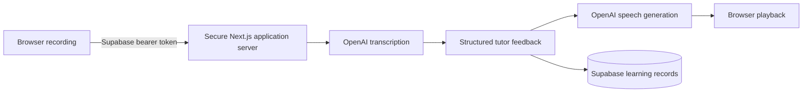

# AI Korean Voice Coach

The AI Korean Voice Coach is Hengo’s mobile-first chained voice practice module. It focuses on listening and speaking for beginner-to-intermediate learners, with workplace Korean for software developers and practical daily-life Korean.

## Learner flow

1. Select one of 20 typed workplace or daily-life scenarios.
2. Start a session and listen to one short Korean question.
3. Try to understand it before revealing Korean, secondary romanization, or English.
4. Record a short Korean answer or use the text fallback.
5. Receive the Korean speech-recognition result and schema-validated tutor feedback.
6. Read the corrected sentence, a natural alternative, and one short explanation.
7. Listen to the correction, try it again, or continue to one follow-up question.
8. Explicitly save useful corrections to the shared mistake/SRS notebook.
9. Finish with a compact session summary and suggested next scenario.

The dedicated listening mode keeps the transcript hidden, allows three explicit replays, accepts a typed comprehension answer, reveals useful vocabulary, and supports slow and normal playback.

## Architecture

The module follows the existing Hengo split:

- `components/korean-coach/*` and `app/(main)/korean-coach/*` own the experience.
- `lib/api/korean-coach.ts` is the only browser integration point for Supabase and the Korean AI routes.
- `app/api/ai/korean/*` verifies the Supabase access token before spending AI credits.
- `lib/server/korean-coach/*` separates transcription, tutor feedback, speech generation, safe errors, configuration, and response handling.
- `lib/korean-coach/*` contains provider-independent schemas, scenario data, prompt construction, mock fixtures, audio validation, listening challenges, and recording state.



All OpenAI calls happen on the server. The client sends audio only to `/api/ai/korean/transcribe`, never to OpenAI directly.

## Persistence

Migration: `supabase/migrations/20260725080920_korean_voice_coach.sql`.

The feature reuses existing Hengo records instead of adding a second learning stack:

- `kori_voice_sessions` stores chained and future realtime session summaries.
- `kori_corrections` stores deduplicated coach mistakes using the existing fingerprint and SRS state.
- `kori_vocab_cards` stores explicitly saved difficult words.
- `kori_korean_practice_turns` stores validated tutor-message snapshots and learning-aid usage.
- `kori_korean_speaking_attempts` stores transcripts and validated feedback, never raw audio.
- `kori_korean_coach_preferences` stores one RLS-owned preference row per learner.

Every new table enables RLS, removes anonymous access, grants only authenticated access, and checks ownership with `auth.uid()`. Indexes cover user, created date, practice mode/status, session, turn, scenario, and mistake review status.

Apply the migration through the normal Supabase workflow before opening the dashboard.

## Environment

Copy `.env.example` to `.env.local` and configure:

| Variable | Required | Purpose |
|---|---:|---|
| `NEXT_PUBLIC_SUPABASE_URL` | yes | Existing shared Supabase project |
| `NEXT_PUBLIC_SUPABASE_PUBLISHABLE_KEY` | yes | Browser-safe Supabase key |
| `OPENAI_API_KEY` | live AI only | Server-only provider key |
| `OPENAI_TEXT_MODEL` | optional | Structured tutor feedback; default `gpt-5.6-terra` |
| `OPENAI_TRANSCRIBE_MODEL` | optional | Korean transcription; default `gpt-4o-transcribe` |
| `OPENAI_TTS_MODEL` | optional | Korean speech; default `tts-1` |
| `KOREAN_COACH_MOCK_MODE` | optional | Explicit `true` enables local mock mode |

Never add `NEXT_PUBLIC_` to an OpenAI variable. Configure the same server-only variables in the production hosting environment.

### Mock mode

Set:

```env
KOREAN_COACH_MOCK_MODE=true
```

Mock mode does not call OpenAI. Transcription and feedback return isolated development fixtures. Speech returns no provider audio, so the browser uses `speechSynthesis` as a preview. The interface explicitly labels the result “Mock browser preview · not AI-generated” and displays a mock-mode banner; it never presents seed feedback as a live AI result.

## Privacy and security

- The browser asks for microphone permission only after the learner taps Record.
- Recording MIME type, duration, and size are checked in the browser and again on the server.
- The server rejects oversized multipart requests before parsing when `Content-Length` is available.
- Recordings are transient: they are sent for transcription and are not written to Supabase or application logs.
- Only transcripts, validated feedback, learning-aid state, preferences, and summaries persist.
- UI copy warns learners not to record sensitive workplace or personal information.
- Learners can delete individual attempts, individual mistakes, a session, or their complete Korean Coach history. Complete-history deletion requires confirmation.
- Route errors use a stable `{ error: { code, message, retryable } }` format and sanitize provider details.
- Usage logs contain model/latency/success metadata only—not audio, prompts, transcripts, or feedback.
- Authentication and the existing rolling 24-hour AI usage buckets provide the MVP abuse-prevention layer. Production scale should add an edge/distributed rate limiter before model calls.

## Error recovery

The UI distinguishes unsupported recording, permission denial, no microphone, microphone busy, empty/short/large/unsupported audio, processing, success, and retryable failure. AI route errors cover authentication, rate limits, timeouts, invalid structured output, transcription, feedback, and speech generation. Text input and transcript-only continuation remain available when audio cannot be used.

## Testing

Tests do not call OpenAI or spend credits.

```bash
pnpm exec tsc --noEmit
pnpm lint
pnpm test
pnpm build
```

Focused coverage includes scenario catalog validation, feedback/request schemas, tutor prompt boundaries, audio validation, safe provider errors, recording-state transitions, explicit mock mode, feedback order, the empty mistake notebook, invalid route input, and a source-level server-key boundary check.

## Known MVP limitations

- The chained pipeline is turn-based, not full-duplex realtime audio.
- Feedback from a transcript cannot provide an exact pronunciation, intonation, accent, phoneme, or 받침 score.
- Browser recording support and MIME output vary; unsupported browsers must use text input.
- TTS quality and availability depend on the configured provider model and network.
- The replay cap governs the explicit Replay action in listening mode.
- Rate limiting uses the existing Supabase usage log and is suitable for the current personal-app scale, not a high-volume public launch.
- Korean Coach metrics are intentionally compact and do not yet feed every platform-wide XP/statistics view.

## Phase 2 plan — do not implement until the chained MVP is stable

1. **Realtime transport behind the current interfaces.** Add an OpenAI Realtime adapter beside the chained transcription/feedback/speech services. Keep `KoreanPhrase`, `KoreanTutorFeedback`, session, attempt, and mistake contracts stable so the UI can select a transport without a rewrite.
2. **Turn-taking and interruption.** Add server-issued ephemeral session credentials, voice activity detection, interruption/cancel events, and deterministic conversation state recovery.
3. **Realtime transcripts.** Persist final transcript segments only; stream partial segments as ephemeral UI state with reconnection and ordering tests.
4. **Evidence-based pronunciation analysis.** Add a separate audio-analysis contract for duration, timing, confidence, phoneme evidence, and uncertainty. Never derive these scores from text alone.
5. **Korean phoneme and 받침 drills.** Build minimal-pair and final-consonant exercises, reference recordings, and acoustic comparison with human-readable uncertainty.
6. **Mistake-driven spaced repetition.** Extend the existing corrections/vocabulary SRS queues with coach turn evidence and difficulty-aware scheduling instead of introducing another scheduler.
7. **Personalized lesson planning.** Generate bounded lesson plans from mastered/unmastered mistakes, vocabulary, scenarios, and learner preferences with transparent source evidence.
8. **K-Specialist simulation.** Reuse the existing interview module’s question bank and history while adding voice turn constraints, time pressure, and presentation rehearsal.
9. **Teacher/mentor review.** Add explicit sharing consent, scoped review access, comments, and revocation/audit controls.
10. **Spring Boot/PostgreSQL option.** If scale or organizational requirements justify a separate backend, move the existing service and repository interfaces behind typed HTTP endpoints; migrate Supabase-owned records to PostgreSQL without changing the learner-facing contracts.

